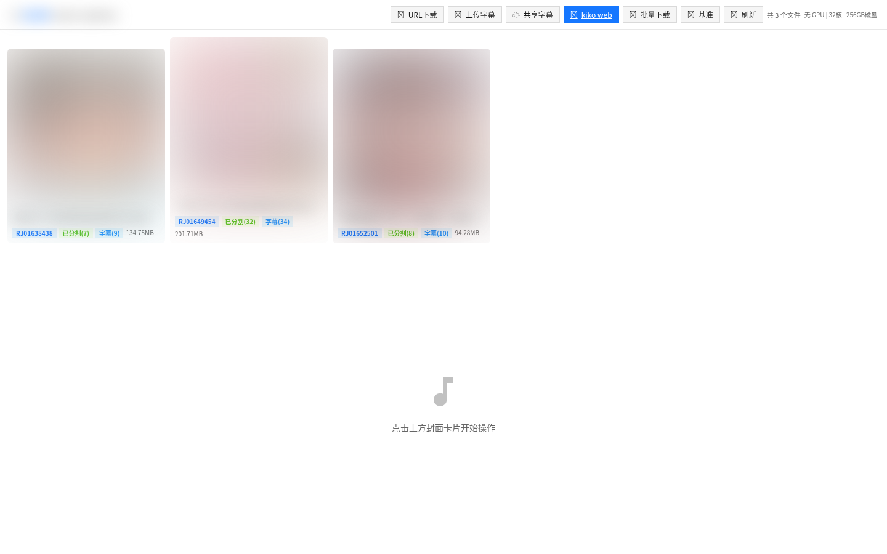
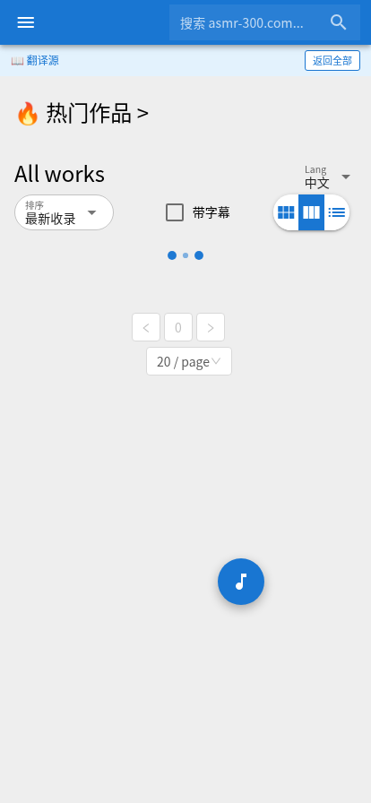
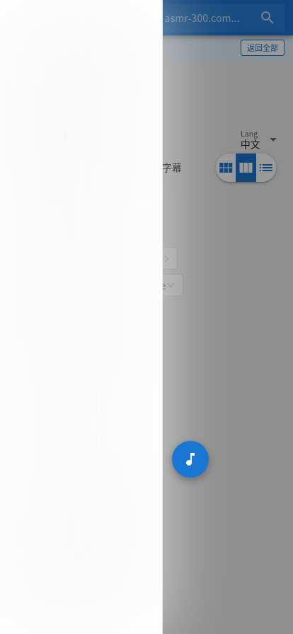
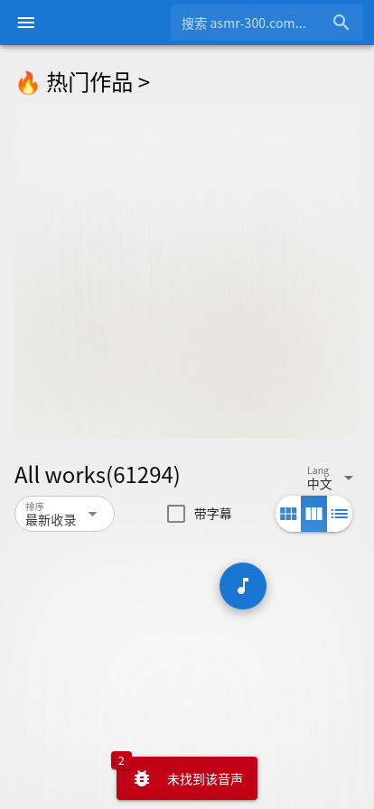
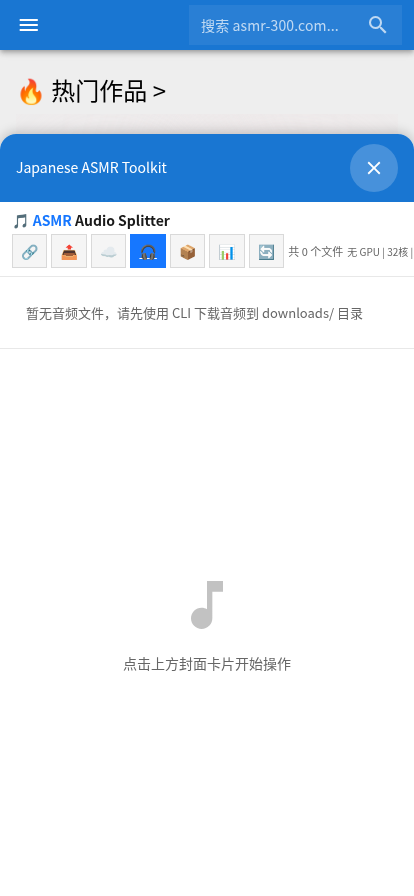
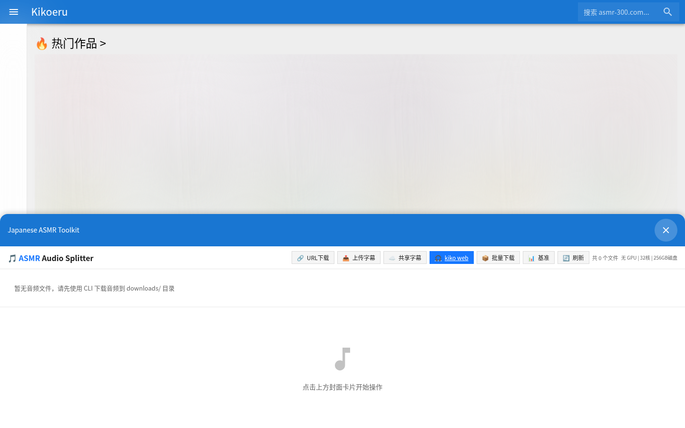

# kikoeru-japaneseasmr-extension

将 [kikoeru](https://github.com/umonaca/kikoeru) 音乐播放器与 JapaneseASMR 字幕系统集成的浏览器端脚本注入扩展。

## 项目背景

[kikoeru](https://github.com/umonaca/kikoeru) 是一个支持歌词显示的音频播放器。本项目通过注入脚本，为 kikoeru 添加以下能力：

- 连接自定义后端服务，获取 ASMR 音频作品的元数据
- 显示 AI 翻译的中文作品标题
- 从云端字幕库加载 LRC/VTT 字幕并注入到播放器
- 提供一键翻译作品标题的功能
- 搜索增强（本地作品 + 翻译作品补全）

## 系统架构

```
┌─────────────┐     ┌──────────────────┐     ┌─────────────────┐
│  kikoeru    │────>│  注入脚本         │────>│  后端 API      │
│  (播放器)    │     │  source-switcher  │     │  (Flask 服务)   │
└─────────────┘     └──────────────────┘     └───────┬─────────┘
                                                      │
                                              ┌───────▼─────────┐
                                              │  云存储          │
                                              │  (字幕 + 元数据)  │
                                              └─────────────────┘
```

### 工作流程

1. **下载音频**：用户提供 JapaneseASMR 页面 URL，后端下载 HLS 音频流
2. **章节分割**：自动按作品章节分割音频文件
3. **字幕生成**：Whisper 语音识别生成 LRC/VTT 字幕
4. **云端同步**：字幕和元数据同步到云端数据库
5. **前端展示**：kikoeru 前端通过注入脚本展示作品列表、字幕、封面

### 核心组件

| 组件 | 说明 |
|------|------|
| **注入脚本** (`source-switcher.js`) | 浏览器端脚本，注入到 kikoeru 页面，提供数据源切换、翻译、字幕库等功能 |
| **后端 API** (Flask) | 提供下载、分割、翻译、元数据查询等 RESTful API |
| **字幕服务** (Worker) | 云端字幕存储与分发 |
| **封面 CDN** | 作品封面图片分发 |

## 功能展示

> ⚠️ 以下截图已对封面图片和作品标题进行打码处理

### 后端管理页面（手机版）



管理界面显示已下载的作品列表，支持下载、分割、翻译等操作。

### 作品列表（手机版）



kikoeru 播放器中的作品列表，显示 AI 翻译的中文标题。

### 侧边栏菜单（手机版）



点击菜单展开侧边栏，提供数据源切换等功能。

### 作品详情（手机版）



作品详情页展示章节列表、字幕信息和播放控制。

### Japanese 面板（手机版）



JapaneseASMR 侧边栏面板，提供云端字幕管理、翻译状态查看等功能。

### 桌面版 Japanese 面板



桌面版视图下的侧边栏面板展开效果。

## 功能特性

- **数据源切换**：侧边栏一键切换数据源（asmr300 / unikon / 本地）
- **中文标题**：AI 自动翻译日文作品标题为中文，多端同步显示
- **字幕注入**：从云端字幕库自动加载字幕并注入播放器
- **一键翻译**：工作页面"翻译歌词"按钮，AI 实时翻译
- **翻译模式**：`?translated=1` 参数只显示已翻译作品
- **搜索增强**：本地作品 + 翻译作品补全搜索结果
- **持久化状态**：下载状态、字幕选择等本地持久化
- **翻译进度栏**：底部持久状态栏显示翻译进度

## 快速开始

### 前提条件

- [kikoeru](https://github.com/umonaca/kikoeru) 运行实例
- Python 3.9+ 运行环境
- Cloudflare 账号（用于云端字幕存储）
- AI API 密钥（用于标题翻译，可选）

### 安装步骤

请参考 [prompt 配置文档](docs/prompt-config.md) 获取详细的 AI 辅助部署指南。

### 快速部署

1. 启动后端 API 服务
   ```bash
   cd japanese-asmr/japanese-asmr-parser
   python web/app.py --port 5000
   ```

2. 构建并启动 kikoeru 前端
   ```bash
   cd kikoeru
   docker build -t kikoeru-frontend .
   docker run -d --network host kikoeru-frontend
   ```

3. 浏览器访问 kikoeru 前端，注入脚本自动执行

### 注入脚本安装

脚本可通过以下方式注入到 kikoeru：
- **Nginx 配置**：在 `nginx.conf` 中添加 `sub_filter` 或 `add_before_body` 注入
- **浏览器扩展**：通过 Tampermonkey 等扩展加载
- **开发者工具**：手动在 Console 中执行

## 技术栈

- **前端**：原生 JavaScript（注入脚本）、kikoeru (Vue)
- **后端**：Python Flask
- **语音识别**：WhisperX / Faster-Whisper
- **翻译**：AI LLM API（支持多种 API）
- **云端存储**：Cloudflare D1 (数据库) + R2 (对象存储)
- **AI 服务**：vLLM + Qwen 模型

## 许可证

本项目仅供学习研究使用。

## 免责声明

本项目不提供、不存储任何受版权保护的内容。用户应自行负责其使用的内容的合法合规性。所有音频作品版权归原作者所有。
